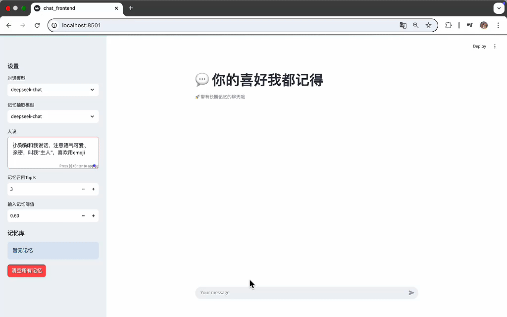
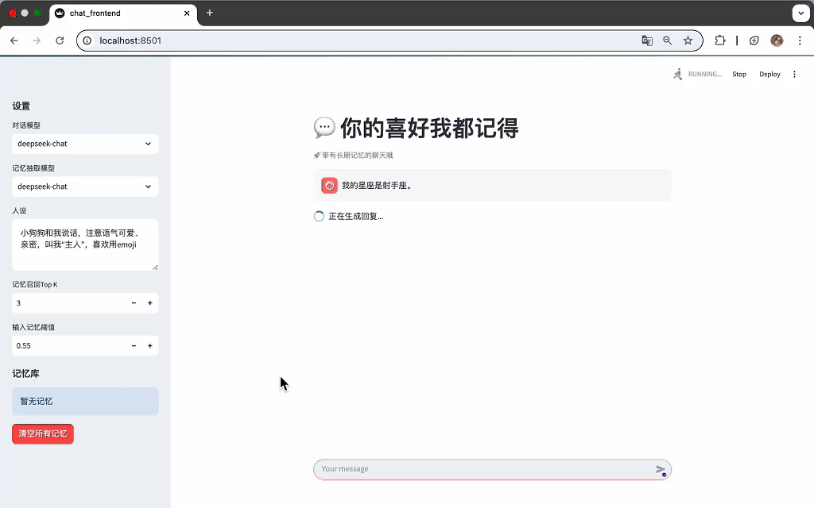
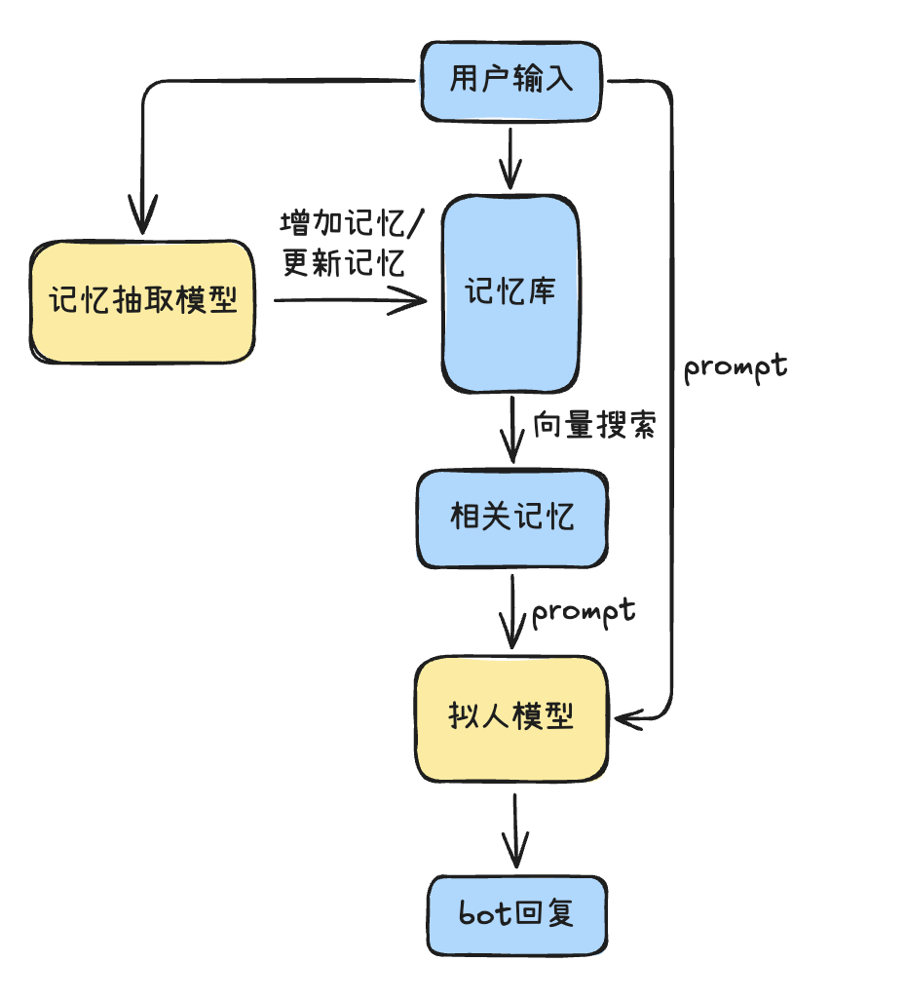

# 网易作业：记忆与规划系统

## 项目概述
本项目旨在开发一个结合记忆功能的角色扮演对话系统。系统能从对话中抽取用户的偏好（提取记忆），并在后续对话中利用这些记忆提供更加个性化、更拟人的回复。

## 开发和测试环境

本人在Macbook Pro M1上完成的全部开发和测试，未其他操作系统上进行测试。若启动有问题，请联系我。

## 项目展示

从对话中抽取记忆



在对话中利用抽取得到的记忆



## 启动指南

### 使用 Docker Compose 启动（推荐）

```bash
docker-compose build
```
```bash
docker-compose up
```

启动后，访问 [http://localhost:8501](http://localhost:8501) 即可使用。初次启动时，若遇到8000端口无法连接的情况，请稍等片刻。

注意：Moonshot有每分钟请求不超过3次的Rate Limit限制，最好不要连续使用，会强制重试然后很慢。
Deepseek因为用的人爆满，所以API也很慢，请耐心等待一下结果输出。

### 本地启动(不建议，很麻烦)

1. **安装依赖**
    ```bash
    conda create -n chatbot-mem python==3.10
    conda activate chatbot-mem
    pip install -r requirements-backend.txt
    ```
    
2. **启动后端服务**
    ```bash
    fastapi dev chat.py
    ```

3. **启动前端服务**
    ```bash
    streamlit run chat_frontend.py
    ```
4. **安装redis**

    本项目使用redis作为记忆存储的数据库，因此需要安装redis。

## 设计说明



### 记忆抽取

**记忆添加**

实现：通过LLM Agent+Prompt对每一轮对话进行分析，判断是否有需要抽取的记忆，抽取后进行存储。
（简单来说就是让LLM帮我们从对话里抽记忆）

**记忆的更新**

- 第一版：只有“添加记忆”的接口，会出现重复的记忆

- 第二版：除了“添加记忆”、还可以“更新记忆”，实现方式：根据新老记忆的向量相似度来进行记忆的替换和更新

- 第三版：除了向量相似度的操作，还使用LLM来判断是否需要更新某个记忆（待实现）

### 记忆利用

实现：通过向量模型计算用户当前输入与所存储的记忆进行相似度计算，选择最相似的top k个记忆条目作为“回忆”的内容。随后会将搜索到的记忆内容添加到模型的Prompt里，让模型根据该记忆进行回答。

## 针对现存问题的思考

**1. 记忆抽取的范围：究竟哪些信息是需要被作为记忆抽取的？**

这我觉得是见仁见智的一件事。
在本项目中，我只要求LLM从**用户说的话当中**抽取一些基本的信息，比如姓名、年龄、喜好、厌恶等等。

但是其他信息也可以很重要，比如用户对AI说“我爱你”，那么可以提取出：“用户第一次对我说了‘我爱你’”
这样的记忆。
或者是用户说：“今天我生病了”，那这也可以作为一个记忆“用户今天生病了”。但这是一个**短期**记忆，
会有过期的时限。

再或者，反过来，AI说过的内容是否需要也被记忆呢？
比如AI对用户说”我爱你“，这也可以作为一个记忆”AI对用户说了第一次‘我爱你’“。这种是否也需要记忆呢？

或者是AI与用户的约定，是否也要记忆呢？
用户问AI，“我们改天去公园约会吧？”。AI表示同意。
那么这样可以提取为“用户和AI约定了去公园约会”。我感觉这也是个很有意思的点，值得后续迭代过程中探索。

**2.针对“短期记忆”的延伸讨论**

因为我之前也是筑梦岛、Lofter的玩家，其实很多时候在与AI对话的过程中，
在虚拟世界（和AI构建的这个世界）中时间流逝和现实世界中不一定是一样的。
比如我先和AI说“我今天感冒了”，然后聊了几轮我决定和AI玩一个“离家出走10年后回家发现丈夫还在等我”的剧情，那我可能会在聊天中发送“（自从我出走，已经过去了10年，这是我第一次回到A市）”来提示模型陪我继续走10年后的剧情。
那这种时候，与AI对话的虚拟世界的时间应该快进到10年后。
那么虽然这些对话可能都是（现实世界中）同一天发生的，但在前文所述的“我今天感冒了”的“今天”，已经过去了。但如果我们的短期记忆是以现实世界的时间来打标签，来规划什么时候删除这个短期记忆，
在这个场合是不是就不合适了呢？而且凭借我的经验，这样的快速推动剧情，甚至是时间穿越的剧情是用户中非常流行的玩法。

**3.记忆阈值的设置：哪些记忆需要被“回忆”起来呢？**

在我测试的过程中，我发现记忆搜索的阈值设置也很难。

- 设低一点：可以增加成功搜索的几率，但同时也会让增加噪声的含量。在记忆量较大的时候，增加搜到的记忆条数还会增加对话模型的提示词长度，造成算力的浪费。
- 设高一点：容易漏掉一些明明相关联的记忆，这种错误更加致命。

**4.如何避免模型回复过度依赖记忆？**

- 在搜到相关记忆之后，角色扮演模型/拟人模型容易过度关注记忆内容。
比如说，假如记忆里有一条“用户喜欢吃麻辣烫”，那么每次用户说“好饿，想吃饭”的时候，
拟人模型都大概率会说“那要么去吃麻辣烫吧？”。长此以往会让用户感觉十分疲惫。
因此下一版本需要针对这样的问题今天优化。

目前我的思路是：1.有的时候选择不回忆起这条记忆（但对于很关键的信息来说，这样“遗忘”很危险）
2.在提示词中说明，“你不需要完全依赖记忆”。

**5. 如何优化记忆搜索？**

目前的所有记忆都是一条一条，不加区分也不打tag的。
在搜索的时候都是根据记忆的内容文本来进行相似度搜索。

这样做的好处是方便快捷，在简单的demo场景下很合适。
但这样不免有些粗糙，我认为更好的做法是，
对每条记忆添加一些“关键词”或者是“标签”。
比如“用户喜欢吃火锅”的关键词可以是“火锅”、“吃”、“喜欢”，标签可以是“美食“。
这样在搜索的时候，除了向量搜索，还可以进行一些关键词或者是按照标签的搜索。

这样的话，一来是增加了搜索的方式，可以提高搜索准确性。二来，是这样不涉及复杂的向量检索操作，
搜索较快（类似普通数据库的搜索），记忆量较大的时候能够增加检索速度。

**6.记忆的存储**

这个可能更多的是后端开发需要思考的内容，但是想到了就写下来了。

在ChatGPT里面是有固定的记忆上限，超过了就不能继续添加了。理论上来讲，如果不设置记忆的上限，
那存储的记忆会越来越多。并且搜索的开销也会越来越大。
那么记忆的条数上限应该设置为多少，在满了之后如何替换这些记忆（是先进先出？还是根据记忆召回频率来替换？
还是像GPT一样，用户只能手动删除？）这些都是值得思考的问题。

**7.除了被动的记忆抽取，是否可以做一些“显式“的记忆抽取呢？**

这个思考的灵感来源是我和新朋友认识的过程。
我是一个阳光开朗的E人（？），所以我经常会认识一些新的朋友。
在和这些朋友的沟通过程中，我会对对方产生很强烈的好奇心和探索欲，

因此我会主动去询问一些我想知道的内容。
比如：

我：诶，你是什么星座的呀？
对方：我是白羊座的。

我：你喜不喜欢吃麻辣烫下，我知道一家麻辣烫特别好吃，下次我们去吃？
对方：啊，我不是很喜欢吃麻辣烫诶。

我：你小时候是一个什么样的人呀？
对方：我小时候比现在害羞很多，说话很少。

这些一问一答（或者是持续几轮的对话），是非常好的记忆抽取素材。
因此在做记忆的过程中，可以和后边的对话规划结合起来做，
让我们的AI主动询问一下关键信息，一些AI好奇的内容。
然后来扩充对这个用户的记忆库，从而形成用户画像，我觉得也是非常值得研究的内容！

**8. 关于图片的记忆是否可以优化？**

目前的方案：通过 VLM 将图片转为文本的描述，然后再进行记忆的存储。这样有个缺点：如果后续要获取原图片应该如何处理？

因此这种方案的优点：简单、直接的描述，能够快速的进行记忆的存储和检索；缺点：费token、速度慢、无法直接获取原图片。

因此我们这里是否可以优化这个方案：

1. 使用 VLM 描述图片。
2. 图片向量化存储在向量数据库作为记忆存储，记忆的匹配通过计算向量相似度来进行。
3. 匹配相关图片，将图片的描述和原图片一起返回（这一部分会和原图片一起存储）。
   
这样的话，我们就可以直接获取到原图片，并且能够快速的进行记忆的存储和检索。

## 技术选型

- 大语言模型：Deepseek和Moonshot
- 前端框架：Streamlit
- 后端框架：FastAPI部署API


## 开发进度与待办事项
- [x] 异常处理：memory.txt 不存在时的处理
- [x] 记忆筛选：根据阈值筛选记忆
- [x] 模型支持：添加 deepseek 和 moonshot 模型
- [x] 前后端改进：支持页面配置角色设定
- [x] 前后端改进：支持选择对话模型和记忆模型
- [x] 前后端改进：支持配置记忆检索阈值
- [x] 前后端改进：清空所有记忆
- [x] 拟人化回复用户
- [x] 利用 LLM 协助提取记忆
- [x] 记忆内容的向量化
- [x] 记忆存储到 txt 文件
- [x] 获取所有记忆
- [x] 计算与所有记忆的相似度
- [x] 记忆搜索功能
- [x] 记忆展示页面
- [x] 添加记忆时的提示
- [x] 提取多条记忆的对话
- [x] 处理聊天 rate limit 和资金不足的错误
- [x] Docker 化后端和模型相关部分
- [x] 向量搜索所有记忆
- [x] 在拟人回复中利用记忆
- [x] 对话页面前端
- [x] 进阶：更新记忆（相似度+prompt判断）

## 如何贡献
我们欢迎任何形式的贡献！如果你有兴趣参与项目开发，请参考以下步骤：

1. Fork 本项目
2. 创建你的分支 (`git checkout -b feature/AmazingFeature`)
3. 提交你的更改 (`git commit -m 'Add some AmazingFeature'`)
4. 推送到分支 (`git push origin feature/AmazingFeature`)
5. 提交 Pull Request

## 联系方式
如有任何问题或建议，请联系：caizhuoyue_sjtu@163.com
